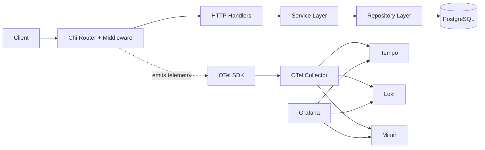
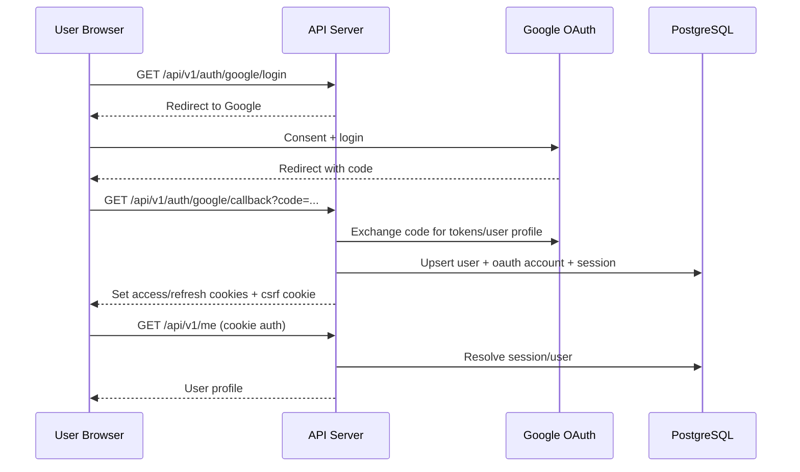
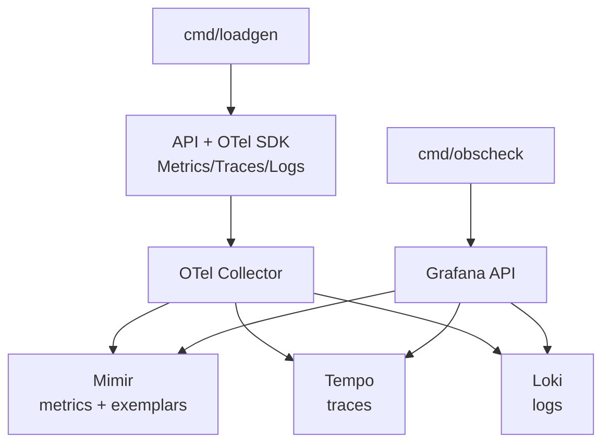

# Secure Observable Go Backend Starter Kit

[](https://github.com/sandeepkv93/secure-observable-go-backend-starter-kit/actions/workflows/ci.yml)
[](https://go.dev/)
[](LICENSE)

Production-oriented Go backend starter with:

- Google OAuth login
- Cookie-based JWT session flow (access + refresh)
- RBAC authorization
- OpenTelemetry metrics, traces, and logs
- Local tri-signal stack (Grafana + Tempo + Loki + Mimir + OTel Collector)
- Bazel + Gazelle + Task + Wire development workflow

## What This Repository Provides

- API server in `cmd/api`
- Operational CLIs in `cmd/migrate`, `cmd/seed`, `cmd/loadgen`, `cmd/obscheck`
- Layered internal packages (`internal/*`) with DI composition through Wire
- Docker compose local stack for DB + observability
- CI + local hooks enforcing build/test/generation hygiene

## Repository Layout

```text
.
├── api/                          # OpenAPI spec
├── cmd/
│   ├── api/                      # HTTP server entrypoint
│   ├── migrate/                  # DB migration CLI
│   ├── seed/                     # seed/bootstrap CLI
│   ├── loadgen/                  # traffic generation CLI
│   └── obscheck/                 # observability validation CLI
├── configs/                      # collector, Grafana, Loki, Tempo, Mimir configs
├── internal/
│   ├── app/                      # app container
│   ├── config/                   # env config + validation
│   ├── database/                 # DB open/migrate/seed
│   ├── di/                       # Wire providers and injectors
│   ├── domain/                   # entities/models
│   ├── http/                     # handlers, middleware, router
│   ├── observability/            # OTel setup and instrumentation helpers
│   ├── repository/               # data access layer
│   ├── security/                 # JWT, cookies, hashing, state
│   ├── service/                  # business logic layer
│   └── tools/                    # shared CLI tool logic (Cobra + Bubble Tea)
├── migrations/                   # SQL migrations (bootstrap)
├── docs/                         # architecture and workflow diagrams
├── taskfiles/                    # modular Task definitions
├── test/integration/             # integration tests
├── docker-compose.yml            # local stack
├── Taskfile.yaml                 # root task loader
└── MODULE.bazel / BUILD.bazel    # Bazel and Gazelle config
```

## Architecture Overview

Request path:

1. Chi router + middleware chain (`internal/http/router`)
2. Handler layer (`internal/http/handler`)
3. Service layer (`internal/service`)
4. Repository layer (`internal/repository`)
5. GORM + Postgres (`internal/database`)

Cross-cutting:

- Security middleware for headers, CSRF, request ID, rate limiting
- Structured logging with trace/span correlation fields
- OTel tracing, metrics (with exemplars), and logs export via collector

Dependency Injection:

- Providers and wiring in `internal/di`
- Regenerated via `task wire`
- Checked via `task wire-check`

## Architecture and Flow Visuals

Additional diagrams are available in `docs/diagrams.md`.

### System Architecture



### OAuth Login and Session Flow



### Observability Data Flow



## Prerequisites

- Go `1.24.13`
- [Task](https://taskfile.dev/)
- [Bazelisk](https://github.com/bazelbuild/bazelisk)
- Docker and Docker Compose (for local stack)

## Taskfile Organization

Root `Taskfile.yaml` includes modular files with `flatten: true`:

- `taskfiles/app.yaml`
- `taskfiles/bazel.yaml`
- `taskfiles/go.yaml`
- `taskfiles/obs.yaml`
- `taskfiles/security.yaml`
- `taskfiles/ci.yaml`

Your command surface stays simple, for example:

- `task run`
- `task ci`
- `task bazel:build`
- `task migrate`
- `task migrate:smoke`
- `task obs-validate`
- `task test:auth-lifecycle`
- `task security`

## Auth Lifecycle Integration Tests

The repo now includes end-to-end auth lifecycle integration coverage in `test/integration/auth_lifecycle_test.go`.

Run only lifecycle tests:

- `task test:auth-lifecycle`

Run all tests:

- `task test`

## Quickstart

1. Create environment file:
   - `cp .env.example .env`
2. Fill required secrets and OAuth values in `.env`.
3. Run local dependencies:
   - `task docker-up`
4. Apply schema:
   - `task migrate`
5. Run API:
   - `task run`
6. Open API and observability endpoints:
   - API: `http://localhost:8080`
   - Grafana: `http://localhost:3000` (`admin/admin`)

## Configuration

Configuration is loaded and validated in `internal/config/config.go`.

## Required Environment Variables

- `DATABASE_URL`
- `JWT_ACCESS_SECRET` (>= 32 chars)
- `JWT_REFRESH_SECRET` (>= 32 chars and different from access secret)
- `REFRESH_TOKEN_PEPPER` (>= 16 chars)
- `OAUTH_STATE_SECRET` (>= 16 chars)
- `GOOGLE_OAUTH_CLIENT_ID`
- `GOOGLE_OAUTH_CLIENT_SECRET`

## Common Optional Environment Variables

- `APP_ENV` (default `development`)
- `HTTP_PORT` (default `8080`)
- `GOOGLE_OAUTH_REDIRECT_URL` (default callback URL)
- `BOOTSTRAP_ADMIN_EMAIL`
- `AUTH_RATE_LIMIT_PER_MIN` (default `30`)
- `API_RATE_LIMIT_PER_MIN` (default `120`)
- `RATE_LIMIT_REDIS_ENABLED` (default `true`)
- `REDIS_ADDR`, `REDIS_PASSWORD`, `REDIS_DB`, `RATE_LIMIT_REDIS_PREFIX`
- `READINESS_PROBE_TIMEOUT` (default `1s`)
- `SERVER_START_GRACE_PERIOD` (default `2s`)
- `SHUTDOWN_TIMEOUT` (default `20s`)
- `SHUTDOWN_HTTP_DRAIN_TIMEOUT` (default `10s`)
- `SHUTDOWN_OBSERVABILITY_TIMEOUT` (default `8s`)
- `COOKIE_DOMAIN`, `COOKIE_SECURE`, `COOKIE_SAMESITE`
- `CORS_ALLOWED_ORIGINS`

OTel:

- `OTEL_SERVICE_NAME`
- `OTEL_ENVIRONMENT`
- `OTEL_EXPORTER_OTLP_ENDPOINT`
- `OTEL_EXPORTER_OTLP_INSECURE`
- `OTEL_METRICS_ENABLED`
- `OTEL_TRACING_ENABLED`
- `OTEL_LOGS_ENABLED`
- `OTEL_METRICS_EXPORT_INTERVAL`
- `OTEL_TRACE_SAMPLING_RATIO`
- `OTEL_LOG_LEVEL`

## `.env.example` Service Naming

`.env.example` is aligned with current defaults and uses:
- `JWT_ISSUER=secure-observable-go-backend-starter-kit`
- `JWT_AUDIENCE=secure-observable-go-backend-starter-kit-api`
- `OTEL_SERVICE_NAME=secure-observable-go-backend-starter-kit`

## Production Hardening

- Graceful shutdown uses phased timeouts:
- `SHUTDOWN_HTTP_DRAIN_TIMEOUT` for HTTP server drain.
- `SHUTDOWN_OBSERVABILITY_TIMEOUT` for OTel provider shutdown.
- `SHUTDOWN_TIMEOUT` as total ceiling.
- Readiness is dependency-backed (`/health/ready`) and checks DB and Redis with `READINESS_PROBE_TIMEOUT`.
- Startup grace can be controlled via `SERVER_START_GRACE_PERIOD`; during grace, readiness returns unready.
- Config enforces stricter production/staging rules:
- secure cookies (`COOKIE_SECURE=true`)
- restricted samesite (`lax` or `strict`)
- Redis-backed rate limiting enabled
- non-loopback Redis address
- bounded sampling ratio (`OTEL_TRACE_SAMPLING_RATIO <= 0.2`)
- non-placeholder secrets

## API Surface

Key routes are in `internal/http/router/router.go`.

Public/health:

- `GET /health/live`
- `GET /health/ready`

Auth:

- `GET /api/v1/auth/google/login`
- `GET /api/v1/auth/google/callback`
- `POST /api/v1/auth/local/register`
- `POST /api/v1/auth/local/login`
- `POST /api/v1/auth/local/change-password` (auth + CSRF required)
- `POST /api/v1/auth/refresh` (CSRF required)
- `POST /api/v1/auth/logout` (auth + CSRF required)

User:

- `GET /api/v1/me` (auth required)

Admin (auth + permission checks):

- `GET /api/v1/admin/users` (`users:read`)
- `PATCH /api/v1/admin/users/{id}/roles` (`users:write`)
- `GET /api/v1/admin/roles` (`roles:read`)
- `POST /api/v1/admin/roles` (`roles:write`)
- `GET /api/v1/admin/permissions` (`permissions:read`)

OpenAPI spec:

- `api/openapi.yaml`

## Security Model

- Access/refresh tokens are managed via secure HTTP-only cookies.
- CSRF token validation is enforced for mutating cookie-auth endpoints.
- Request IDs are attached through middleware for log correlation.
- RBAC is permission-based and enforced in route middleware.
- Auth and API endpoints use separate fixed-window rate limiters.

## Command-Line Tools (`cmd/*`)

All tools use Cobra and default to TUI output via Bubble Tea/Lip Gloss.
Use `--ci` for non-interactive JSON output.

Detailed command docs now live next to each command:
- API server: `cmd/api/README.md`
- Migration CLI: `cmd/migrate/README.md`
- Seed CLI: `cmd/seed/README.md`
- Load generation CLI: `cmd/loadgen/README.md`
- Observability validation CLI: `cmd/obscheck/README.md`

Quick examples:

```bash
go run ./cmd/api
go run ./cmd/migrate status --ci
go run ./cmd/seed dry-run --ci
go run ./cmd/loadgen run --profile mixed --duration 10s --ci
go run ./cmd/obscheck run --ci
```

## Task Reference

App/runtime:

- `task run`
- `task migrate`
- `task migrate:smoke`
- `task migrate:status`
- `task migrate:plan`
- `task seed`
- `task seed:dry-run`
- `task seed:verify-local-email`
- `task docker-up`
- `task docker-down`

Bazel:

- `task bazel:build`
- `task bazel:test`
- `task bazel:run`
- `task gazelle`
- `task gazelle:check`

Go checks:

- `task test`
- `task lint`
- `task tidy-check`
- `task wire`
- `task wire-check`
- `task cli:smoke`

Observability:

- `task obs-generate-traffic`
- `task obs-validate`

Quality gate:

- `task ci`
- `task security`

## Build and Test Strategy

Bazel-first workflow:

- Build all: `task bazel:build`
- Test all Bazel tests: `task bazel:test`

Go-native checks:

- `task test`
- `task lint`

Generation checks:

- `task gazelle:check`
- `task wire-check`
- `task tidy-check`

Pinned versions:

- Go toolchain pinned to `1.24.13` in `go.mod` and Bazel module setup.

## CI Pipeline

GitHub Actions workflow: `.github/workflows/ci.yml`

Pipeline steps:

1. Checkout
2. Setup Go from `go.mod`
3. Install Task
4. Setup Bazelisk
5. Run `task bazel:build`
6. Run `task bazel:test`
7. Run `task gazelle:check`
8. Run `task tidy-check`
9. Run `task wire-check`
10. Run `task security`
11. Run migration smoke job (`task migrate:smoke`) against CI Postgres service

## Git Hooks

Install repository hooks:

- `task hooks-install`

Hooks:

- `.githooks/pre-commit`
  - formats staged `.go` files with `gofmt`
  - runs `go mod tidy`
- `.githooks/pre-push`
  - runs `task ci`

## Local Observability Stack

`docker-compose.yml` starts:

- Postgres
- OTel Collector
- Tempo
- Loki
- Mimir
- Grafana
- API

Ports:

- API: `8080`
- Grafana: `3000`
- Tempo: `3200`
- Loki: `3100`
- Mimir: `9009`
- Collector OTLP gRPC: `4317`
- Collector OTLP HTTP: `4318`
- Collector health: `13133`

Validation flow:

- `task obs-generate-traffic`
- `task obs-validate`

The validation command checks:

- metric exemplar exists
- trace retrievable in Tempo
- correlated trace log retrievable in Loki

## Troubleshooting

### App fails to start with config validation errors

- Check required env vars in `.env`.
- Ensure secret lengths satisfy validation rules.

### Bazel/Gazelle check fails

- Run:
  - `task gazelle`
  - `task tidy-check`
  - `task wire-check`

### `obs-validate` fails with no trace/log correlation

- Ensure stack is up: `task docker-up`
- Confirm Grafana auth (`admin/admin` unless changed)
- Re-run with fresh traffic:
  - `task obs-generate-traffic`
  - `task obs-validate`

### OAuth callback issues

- Verify Google OAuth app redirect URI exactly matches:
  - `http://localhost:8080/api/v1/auth/google/callback`

## License

MIT License. See `LICENSE`.

Copyright (c) Sandeep Vishnu.
