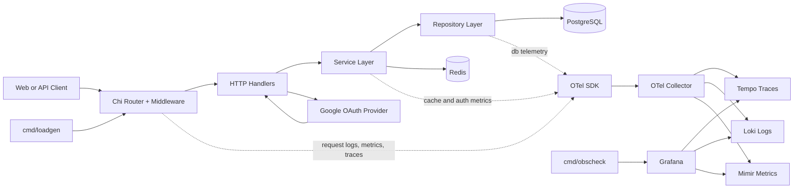

# Secure Observable Go Backend Starter Kit

[](https://github.com/sandeepkv93/secure-observable-go-backend-starter-kit/actions/workflows/ci.yml)
[](https://go.dev/)
[](LICENSE)

## Starter Overview

This repository is a production-oriented Go backend starter that brings together authentication, authorization, observability, and delivery tooling in one baseline:

- Google OAuth login
- Cookie-based JWT session flow (access + refresh)
- Session/device management APIs (`/api/v1/me/sessions`)
- RBAC authorization
- Redis-backed caching for admin list, RBAC permission, and negative lookup flows
- Redis-backed rate limiting and abuse-protection controls
- OpenTelemetry metrics, traces, and logs
- Local tri-signal stack (Grafana + Tempo + Loki + Mimir + OTel Collector)
- Bazel + Gazelle + Task + Wire development workflow
- API server in `cmd/api`
- Operational CLIs in `cmd/migrate`, `cmd/seed`, `cmd/loadgen`, `cmd/obscheck`
- Layered internal packages (`internal/*`) with DI composition through Wire
- Docker Compose local stack for DB + observability
- CI + local hooks enforcing build/test/generation hygiene

Architecture overview:

- Request path:
  Chi router + middleware chain (`internal/http/router`) -> handler layer (`internal/http/handler`) -> service layer (`internal/service`) -> repository layer (`internal/repository`) -> GORM + Postgres (`internal/database`)
- Cross-cutting:
  security middleware for headers, CSRF, request ID, and rate limiting; Redis-backed caching and limiter policies; structured logging with trace/span correlation fields; OTel tracing, metrics (with exemplars), and logs export via collector
- Dependency injection:
  providers and wiring in `internal/di`, with generated wiring verified in CI



## Quick Start

Prerequisites:

- Go `1.24.13`
- [Task](https://taskfile.dev/)
- [Bazelisk](https://github.com/bazelbuild/bazelisk)
- Docker + Docker Compose

Run locally:

```bash
task docker-up
task migrate
task seed
task run
```

Useful commands:

```bash
task test
task ci
task obs-generate-traffic
task obs-validate
```

## Documentation

- Project guide (full documentation): `docs/project-guide.md`
- Architecture and flow diagrams: `docs/diagrams.md`
- Audit taxonomy: `docs/audit-taxonomy.md`

Key folders:

- API server: `cmd/api`
- Internal app packages: `internal/`
- Configuration and observability stack: `configs/`
- Integration tests: `test/integration/`
- Task definitions: `taskfiles/`

## License

MIT. See `LICENSE`.
