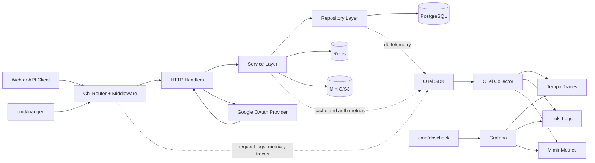

# Everything Backend Starter Kit

[](https://github.com/sandeepkv93/everything-backend-starter-kit/actions/workflows/ci.yml)
[](https://github.com/sandeepkv93/everything-backend-starter-kit/actions/workflows/fuzz-nightly.yml)
[](https://github.com/sandeepkv93/everything-backend-starter-kit/actions/workflows/k8s-kind-smoke.yml)
[](https://go.dev/)
[](https://bazel.build/)
[](LICENSE)

## Table of Contents

- [Overview](#overview)
- [Tech Stack](#tech-stack)
- [Architecture at a Glance](#architecture-at-a-glance)
- [Quick Start](#quick-start)
- [Documentation](#documentation)
- [License](#license)

## Overview

This repository is a production-oriented Go backend starter that brings together authentication, authorization, observability, and delivery tooling in one baseline:

- Google OAuth login
- Cookie-based JWT session flow (access + refresh)
- Session/device management APIs (`/api/v1/me/sessions`)
- RBAC authorization
- Redis-backed caching for admin list, RBAC permission, and negative lookup flows
- Redis-backed rate limiting and abuse-protection controls
- OpenTelemetry metrics, traces, and logs
- Local tri-signal stack (Grafana + Tempo + Loki + Mimir + OTel Collector)
- Bazel + Gazelle + Task + Wire development workflow
- API server in `cmd/api`
- Operational CLIs in `cmd/migrate`, `cmd/seed`, `cmd/loadgen`, `cmd/obscheck`
- Layered internal packages (`internal/*`) with DI composition through Wire
- Docker Compose local stack for DB + observability
- CI + local hooks enforcing build/test/generation hygiene

## Tech Stack

- Language/runtime: [](https://go.dev/)
- HTTP framework: [](https://github.com/go-chi/chi)
- Persistence: [](https://www.postgresql.org/) [](https://gorm.io/)
- Cache/rate limiting/idempotency backend: [](https://redis.io/)
- Object storage: [](https://min.io/)
- Auth: [](https://developers.google.com/identity/protocols/oauth2) [](https://jwt.io/)
- Observability: [](https://opentelemetry.io/) [](https://opentelemetry.io/docs/collector/) [](https://grafana.com/) [](https://grafana.com/oss/tempo/) [](https://grafana.com/oss/loki/) [](https://grafana.com/oss/mimir/)
- Tooling: [](https://taskfile.dev/) [](https://github.com/bazelbuild/bazelisk) [](https://github.com/bazelbuild/bazel-gazelle) [](https://github.com/google/wire) [](https://golangci-lint.run/) [](https://github.com/securego/gosec) [](https://pkg.go.dev/golang.org/x/vuln/cmd/govulncheck) [](https://github.com/gitleaks/gitleaks)

## Architecture at a Glance

- Request path: `internal/http` ==> `internal/service` ==> `internal/repository` ==> `internal/database`
- Cross-cutting concerns: `internal/security`, `internal/observability`, middleware, and Redis-backed controls
- Dependency injection: `internal/di` (Wire-generated injectors validated in CI)



## Quick Start

### Prerequisites:

- [Go `1.26.0`](https://go.dev/dl/)
- [Task](https://taskfile.dev/)
- [Bazelisk](https://github.com/bazelbuild/bazelisk) (uses Bazel `9.0.0` from `.bazelversion`)
- [Docker](https://docs.docker.com/get-docker/) + [Docker Compose](https://docs.docker.com/compose/)

### Clone the repo and cd into it

```bash
git clone git@github.com:sandeepkv93/everything-backend-starter-kit.git
cd everything-backend-starter-kit
```

### Configure environment

```bash
cp .env.example .env
```

### Start local dependencies and run API

```bash
task docker-up
task migrate
task seed
task run
```

### Database reset/backup/restore (local)

These commands operate on the Docker Compose-managed Postgres service (`db`) and its data volume.

```bash
# reset Postgres container + DB volume and start fresh db service
task integration:reset-db

# create SQL backup (default: backups/backup_<timestamp>.sql)
task integration:backup-db

# restore from backup file
task integration:restore-db FILE=backups/backup_20260217_103000.sql
```

### Expected success checks

```bash
curl -sSf http://localhost:8080/health/live
curl -sSf http://localhost:8080/health/ready
```

### Pre-commit workflow

Install hooks and local tooling:

```bash
task hooks-install
```

Run the full hook suite manually:

```bash
task hooks-run-all
# or, if pre-commit is already on PATH:
pre-commit run --all-files
```

Hook coverage includes Go formatting/linting (`gofmt`, `goimports`, `golangci-lint`, `go mod tidy`), Dockerfile linting (`hadolint`), YAML linting (`yamllint`), and secret scanning (`detect-secrets`).

Endpoints:

- API base URL: `http://localhost:8080`
- Grafana UI: `http://localhost:3000` (`admin` / `admin`)
- MinIO Console: `http://localhost:9001` (`minioadmin` / `minioadmin`)

## Documentation

- [Project guide (full documentation)](docs/project-guide.md)
- [Architecture and flow diagrams](docs/diagrams.md)
- [Kubernetes deployment guide](k8s/README.md)
- [Audit Taxonomy](docs/audit-taxonomy.md)

## License

MIT. See [LICENSE](LICENSE) for details.
