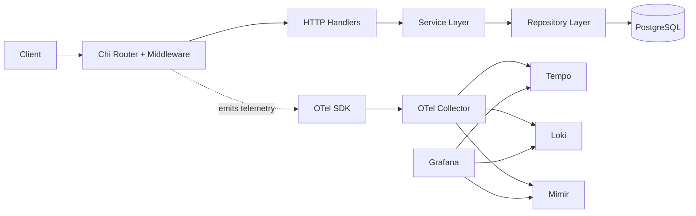
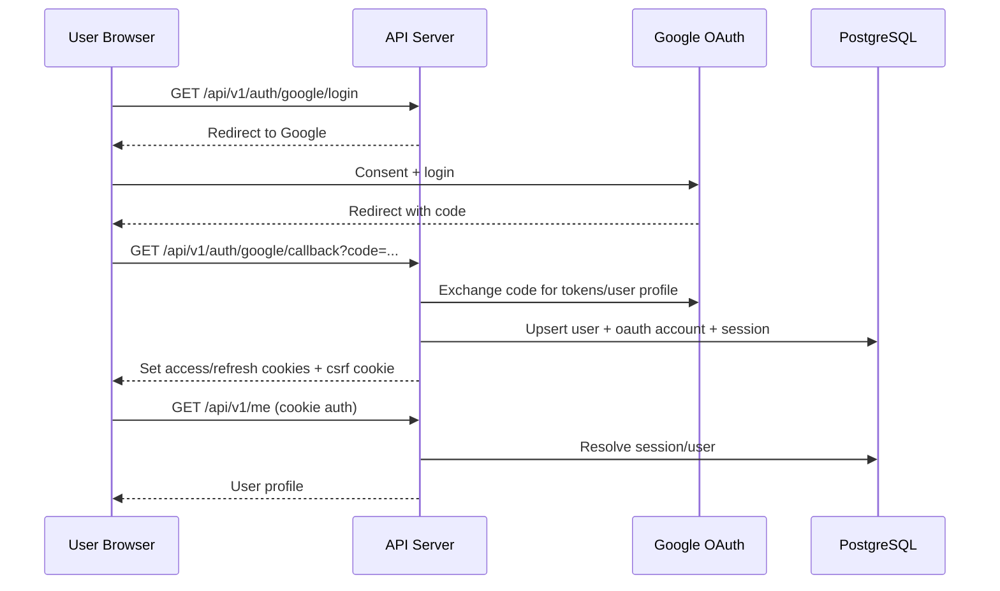
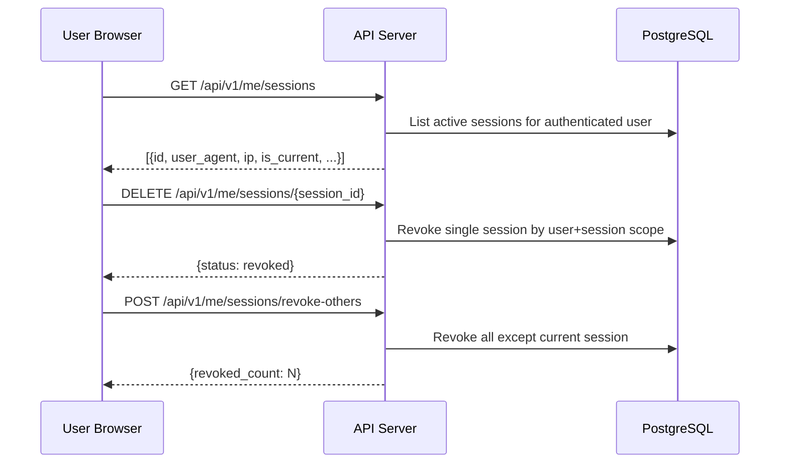
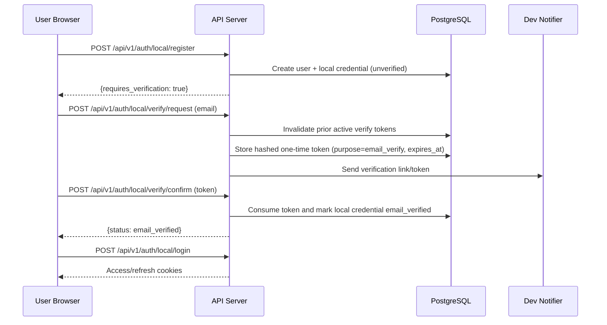
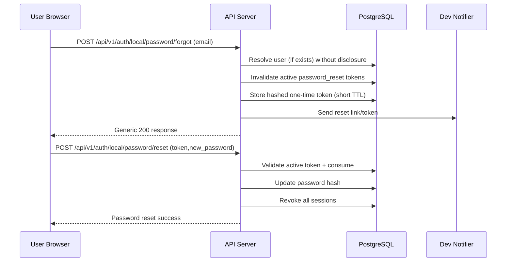
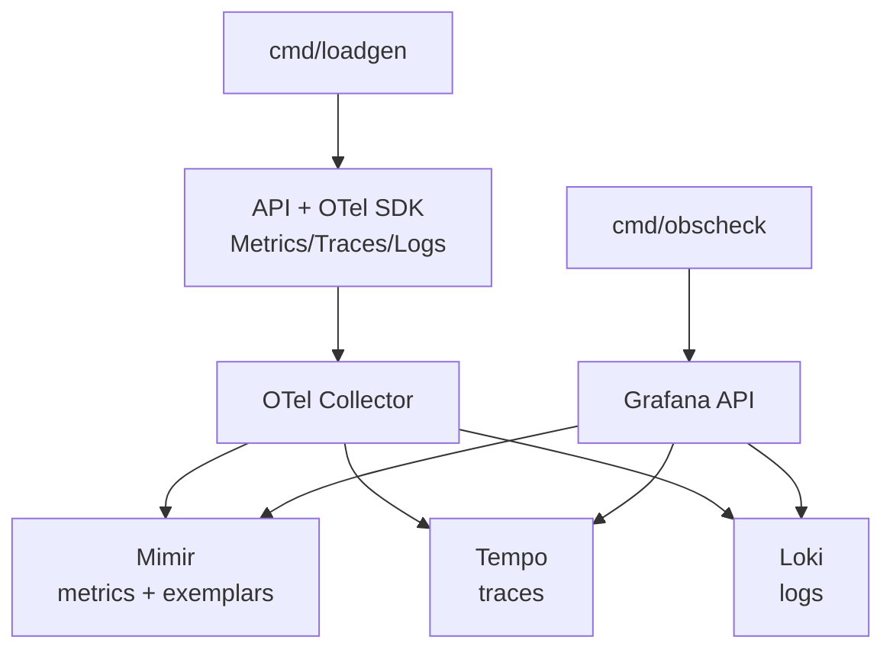
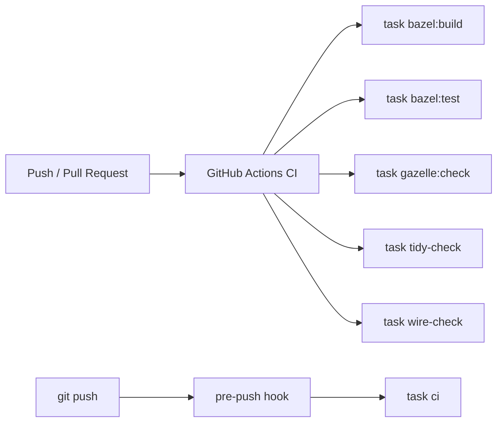
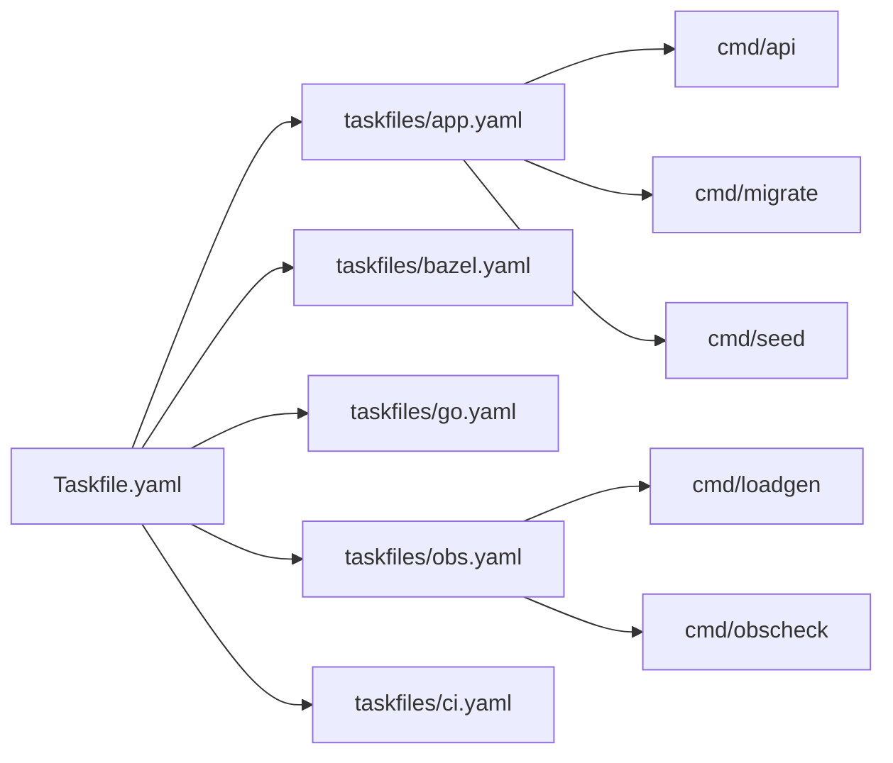

# Architecture and Flow Diagrams

This document contains Mermaid sources for major repository workflows.
The same diagrams are also summarized in `README.md`.

## System Architecture

Source: `docs/diagrams/architecture.mmd`

## OAuth Login and Session Flow

Source: `docs/diagrams/auth-flow.mmd`

## Session Device Management Flow

Source: `docs/diagrams/session-management-flow.mmd`

## Local Email Verification Flow

Source: `docs/diagrams/email-verification-flow.mmd`

## Local Password Reset Flow

Source: `docs/diagrams/password-reset-flow.mmd`

## Observability Data Flow

Source: `docs/diagrams/observability-flow.mmd`

## CI and Local Quality Gate Flow

Source: `docs/diagrams/ci-flow.mmd`

## Taskfile and Command Entry Flow

Source: `docs/diagrams/tooling-flow.mmd`
