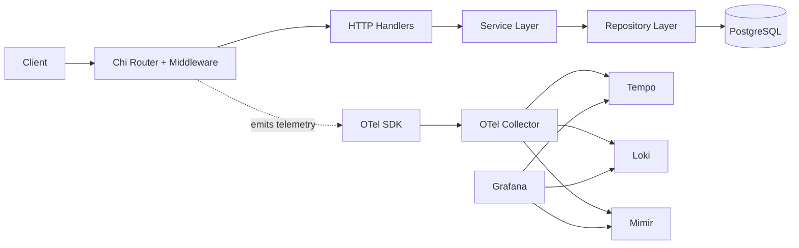
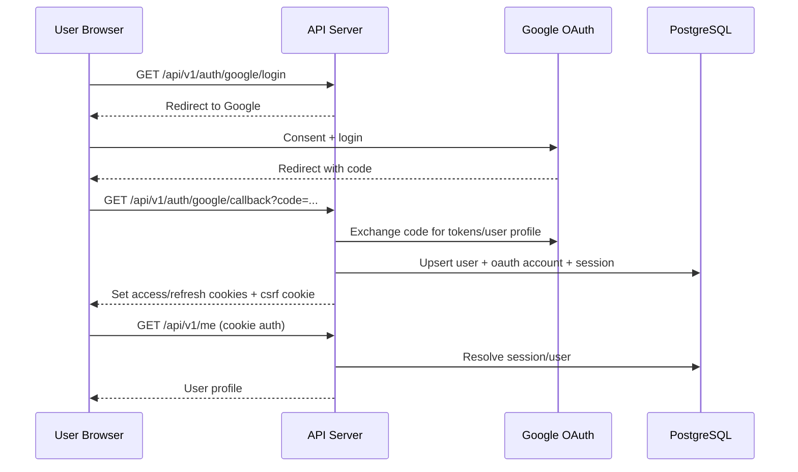
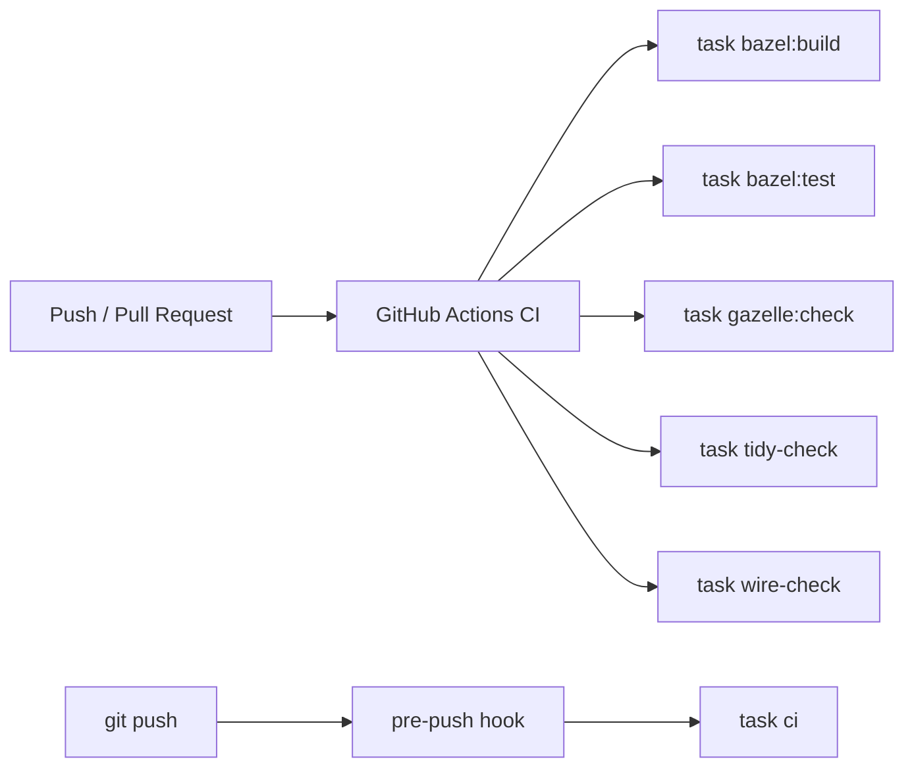
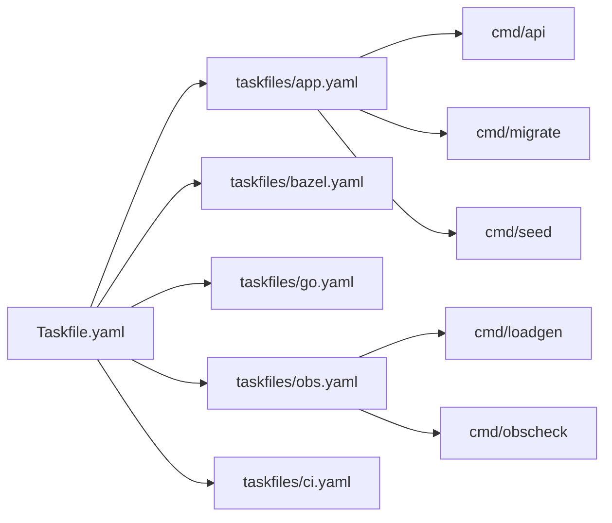

# Architecture and Flow Diagrams

This document contains Mermaid sources for major repository workflows.
The same diagrams are also summarized in `README.md`.

## System Architecture



Source: `docs/diagrams/architecture.mmd`

## OAuth Login and Session Flow



Source: `docs/diagrams/auth-flow.mmd`

## Observability Data Flow

```mermaid
flowchart TD
    API[API + OTel SDK]\nMetrics/Traces/Logs --> COL[OTel Collector]
    COL --> MIMIR[Mimir\nmetrics + exemplars]
    COL --> TEMPO[Tempo\ntraces]
    COL --> LOKI[Loki\nlogs]

    LOADGEN[cmd/loadgen] --> API
    OBSCHECK[cmd/obscheck] --> GRAFANA[Grafana API]
    GRAFANA --> MIMIR
    GRAFANA --> TEMPO
    GRAFANA --> LOKI
```

Source: `docs/diagrams/observability-flow.mmd`

## CI and Local Quality Gate Flow



Source: `docs/diagrams/ci-flow.mmd`

## Taskfile and Command Entry Flow



Source: `docs/diagrams/tooling-flow.mmd`
