# Architecture and Flow Diagrams

This document contains Mermaid sources for major repository workflows.
The same diagrams are also summarized in `README.md`.
For canonical audit event schema and query taxonomy, see `docs/audit-taxonomy.md`.

## System Architecture

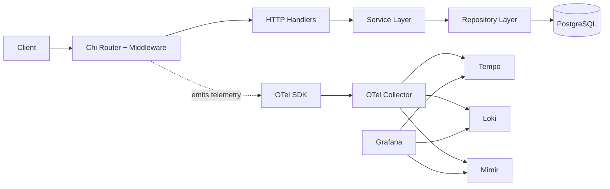

Source: `docs/diagrams/architecture.mmd`

## OAuth Login and Session Flow

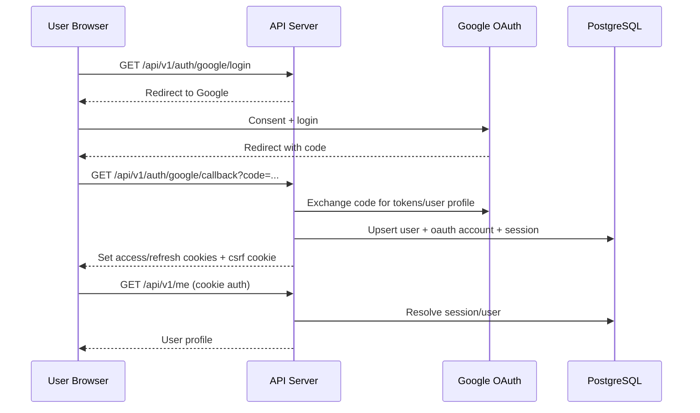

Source: `docs/diagrams/auth-flow.mmd`

## Session Device Management Flow

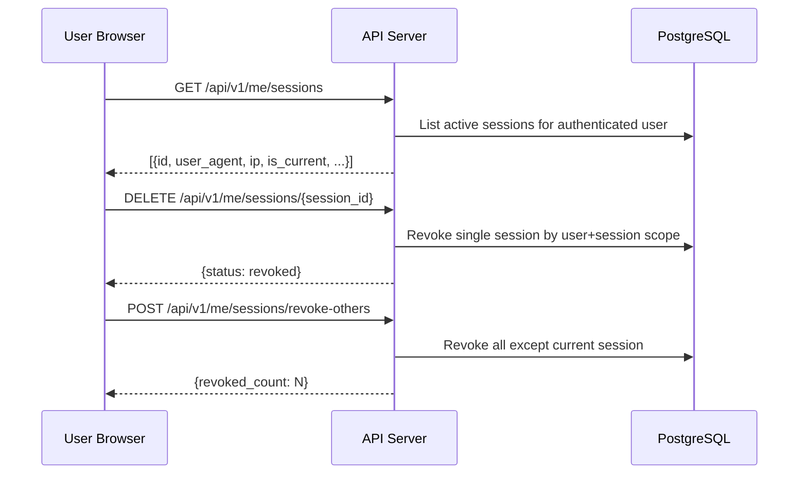

Source: `docs/diagrams/session-management-flow.mmd`

## Local Email Verification Flow

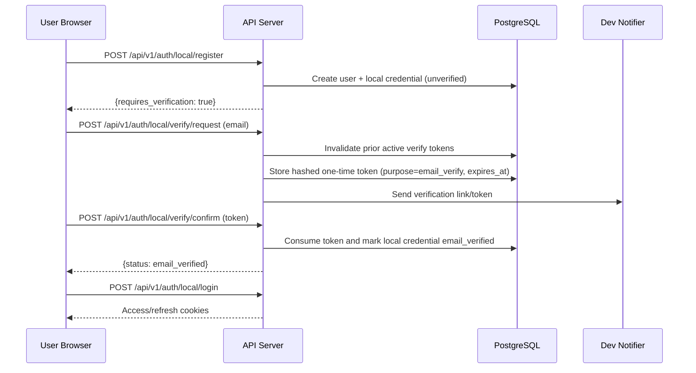

Source: `docs/diagrams/email-verification-flow.mmd`

## Local Password Reset Flow

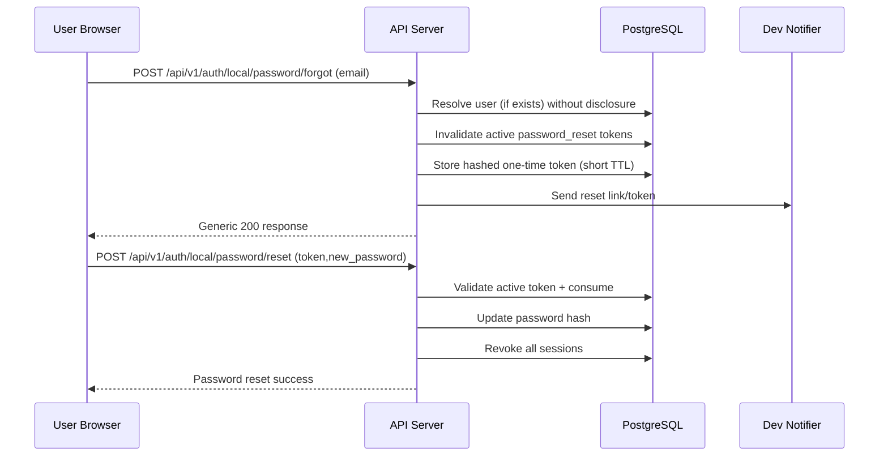

Source: `docs/diagrams/password-reset-flow.mmd`

## Admin RBAC Write and Sync Flow

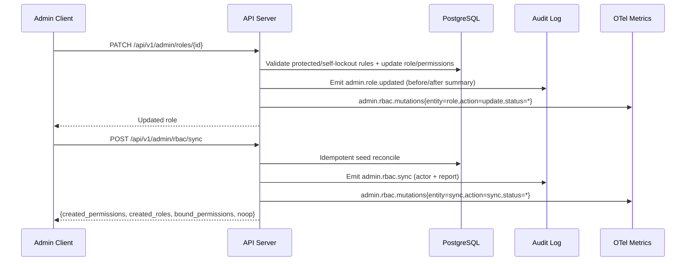

Source: `docs/diagrams/rbac-admin-flow.mmd`

## RBAC Permission Cache Flow

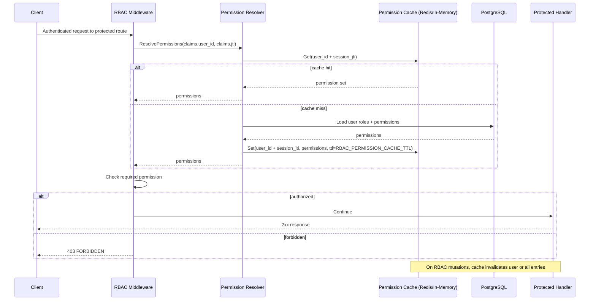

Source: `docs/diagrams/rbac-permission-cache-flow.mmd`

## Idempotency Key Flow

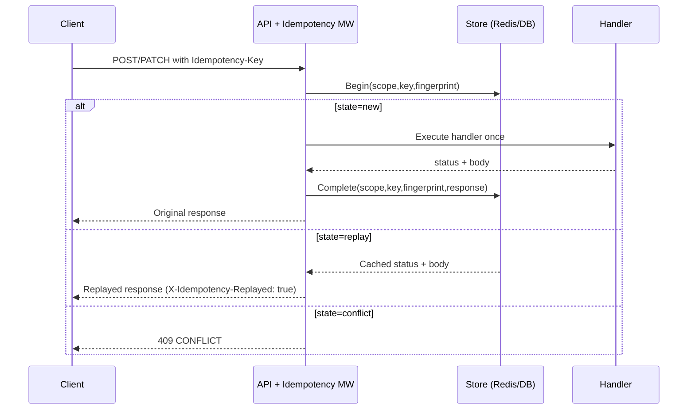

Source: `docs/diagrams/idempotency-flow.mmd`

## Admin List Pagination and Filtering Flow

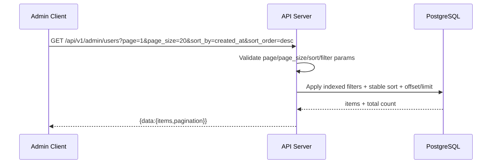

Source: `docs/diagrams/admin-list-query-flow.mmd`

## Admin List Read-Through Cache Flow

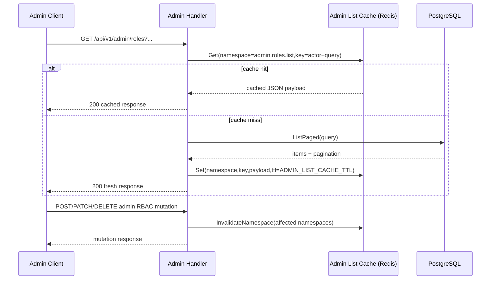

Source: `docs/diagrams/admin-list-cache-flow.mmd`

## Admin List Singleflight Dedupe Flow

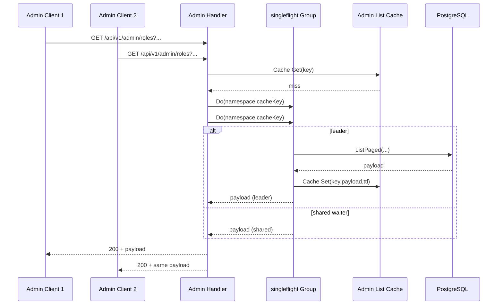

Source: `docs/diagrams/admin-list-singleflight-flow.mmd`

## Admin List Conditional ETag Flow

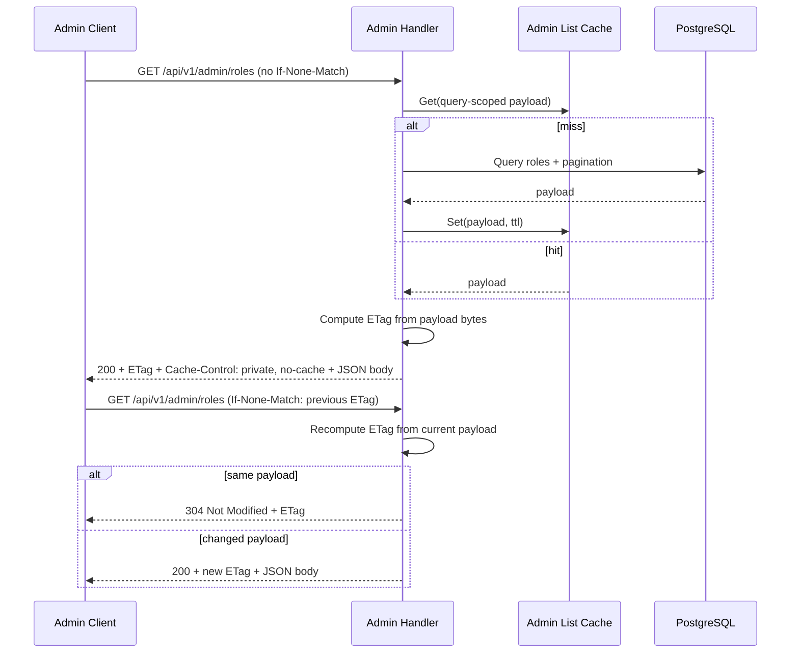

Source: `docs/diagrams/admin-list-etag-flow.mmd`

## Error Negotiation Flow (Envelope vs RFC7807)

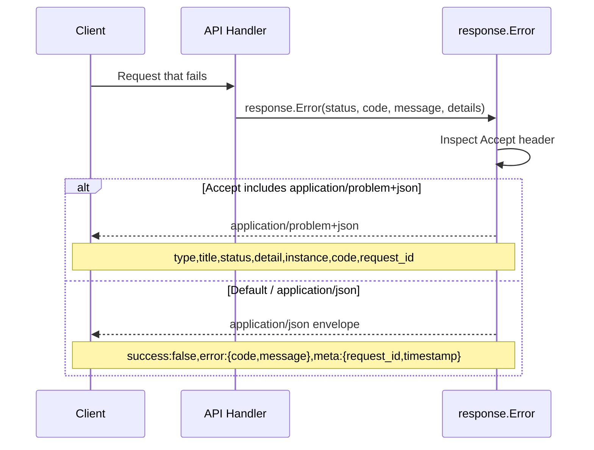

Source: `docs/diagrams/problem-details-flow.mmd`

## Observability Data Flow

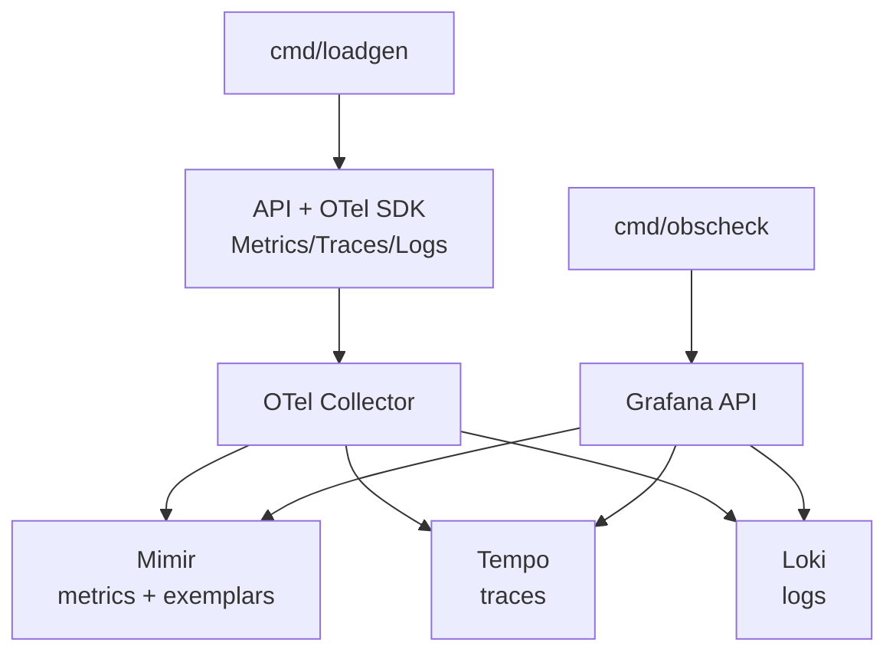

Source: `docs/diagrams/observability-flow.mmd`

## CI and Local Quality Gate Flow

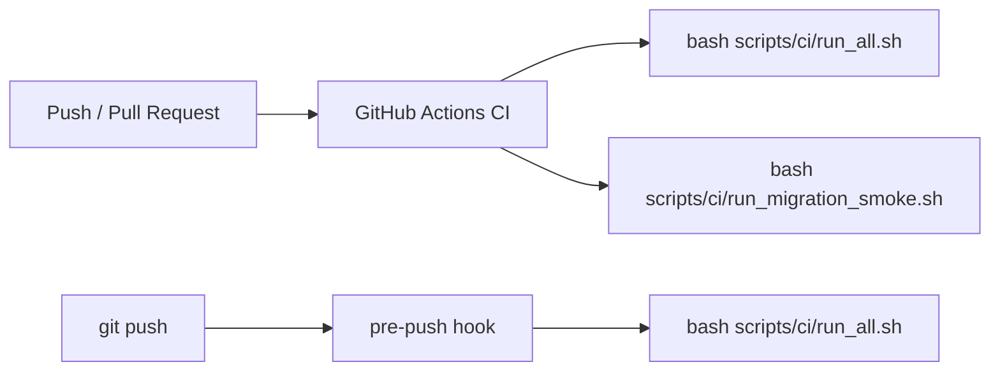

Source: `docs/diagrams/ci-flow.mmd`

## Taskfile and Command Entry Flow

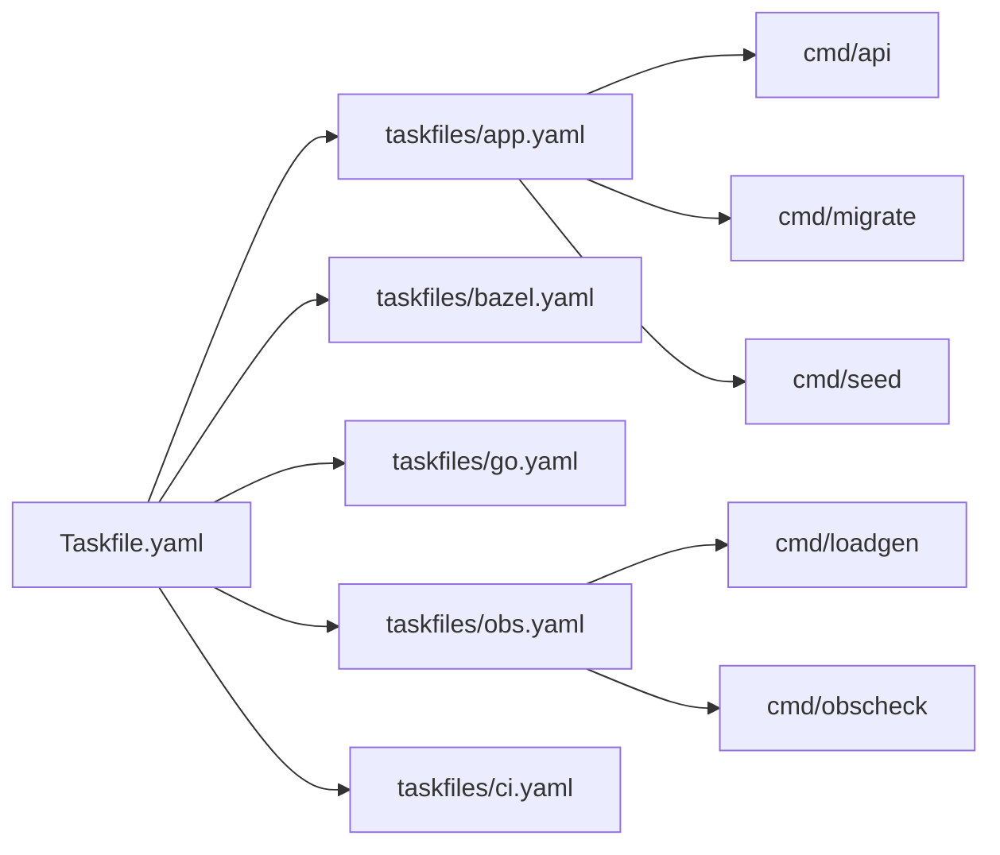

Source: `docs/diagrams/tooling-flow.mmd`
